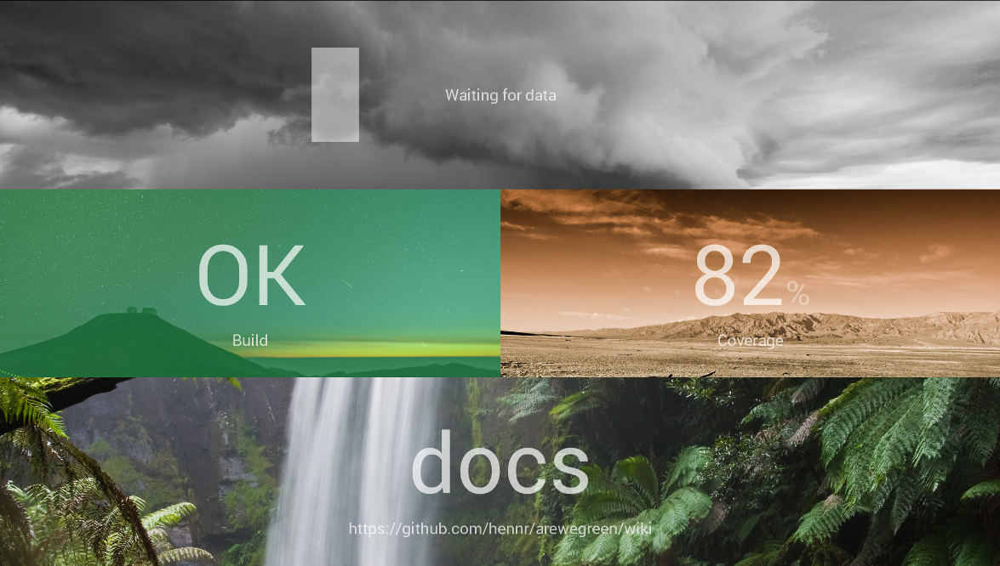

# AreWeGreen?

Out-of-the-box dashboard

Are all Systems up and running fine?
Are all tests passing?
These are common question developers have to answer several times a day.

AreWeGreen has the goal to empower you giving the right answers as quick as possible.

The result could look like this:

## Get started

areWeGreen is not yet finished. Here is the plan though:

To run areWeGreen you simply need to fetch a release and add the executable to your autostarted programs.
areWeGreen will create a configuration folder in the home directory of the current user then.
Also it will start a browser which will open the dashboard in a maximized window for you.

## License

AreWeGreen is licensed under the GPLv3+.

It includes [dashbot](https://github.com/sbstnmsch/dashbot/) (src/main/resources/static) which is licensed under the [MIT License](LICENSE-dashbot).
